<p align="center">
  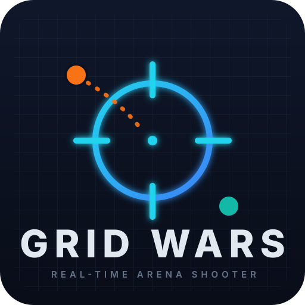
</p>

<h1 align="center">Grid Wars</h1>

<p align="center">
  <strong>A real-time, browser-based 2D arena shooter.</strong><br/>
  Create a room, invite up to 8 players, pick a map, and fight with guns, grenades, gas and jetpacks — or practice offline against AI bots.
</p>

<p align="center">
  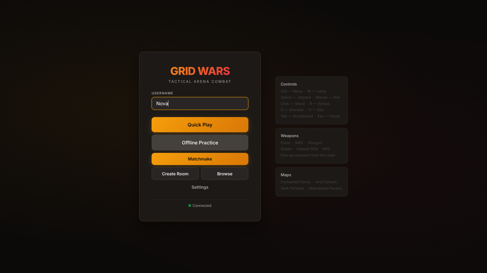
</p>

---

## Table of Contents

- [What is Grid Wars?](#what-is-grid-wars)
- [Screenshots](#screenshots)
- [Features at a Glance](#features-at-a-glance)
- [Architecture: What the Frontend and Backend Do](#architecture-what-the-frontend-and-backend-do)
- [Getting Started](#getting-started)
- [Configuration](#configuration)
- [Gameplay Guide](#gameplay-guide)
- [Networking Internals](#networking-internals)
- [Project Structure](#project-structure)
- [Deployment](#deployment)
- [Troubleshooting & Known Quirks](#troubleshooting--known-quirks)
- [Tech Stack](#tech-stack)

---

## What is Grid Wars?

**Grid Wars** is a multiplayer arena shooter that runs entirely in the browser. It is built as a classic client–server game:

- a **React + Vite frontend** that renders the game on a canvas, plays all sound effects (synthesized live — no audio files), and predicts your movement locally so the game feels instant; and
- an **Express + Socket.IO backend** that runs the *authoritative* simulation — physics, bullets, grenades, pickups, health, respawns — so every player sees the same truth.

It is for anyone who wants a zero-install, quick-to-join deathmatch: share a room code and play. It also has a fully offline **Practice mode** against three AI bots, and a **mobile mode** with touch joysticks, so it works on phones and tablets too.

Design highlights:

- **Rooms up to 8 players** with a room browser, quick-play and matchmaking
- **4 hand-designed maps** — Enchanted Forest, Arid Canyon, Dark Fortress, Abandoned Factory
- **6 weapons** with distinct roles (from an 18-damage pistol to an explosive RPG)
- **Pickups & power-ups**: health, armor, jet fuel, grenades, weapons, speed boost, rapid fire
- **Tactical tools**: frag grenades and gas clouds that deal damage over time
- **Jetpacks** with a fuel budget on every player
- **Built-in cheat codes** (this is a sandbox-style game — cheats are a feature, toggled from the pause menu)
- **Scoreboard, kill feed, minimap**, respawn timer — the full arena-shooter HUD

---

## Screenshots

All screenshots below are **real gameplay captures** taken by an automated Playwright harness driving two browsers against a live server.

| | |
|---|---|
| 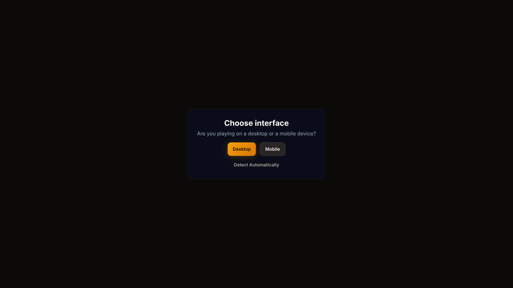 |  |
| *First visit — choose desktop or mobile mode* | *Main menu (online status, room actions, profile)* |
| 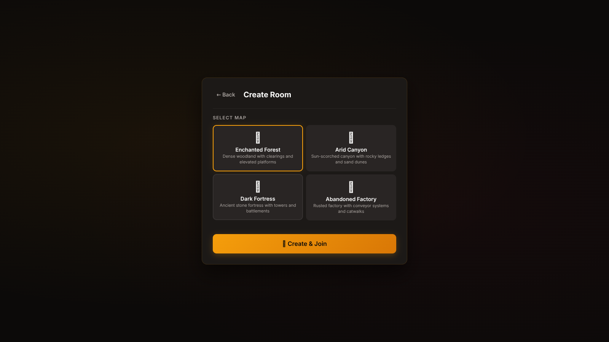 | 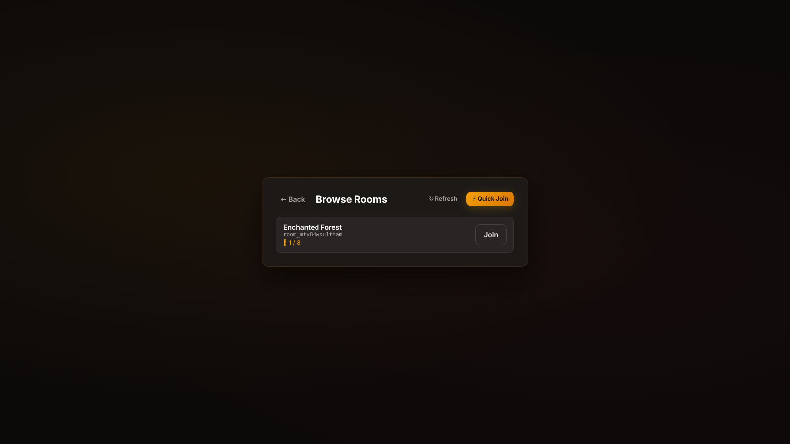 |
| *Create a room — pick a map and settings* | *Room browser — join any listed room* |
| 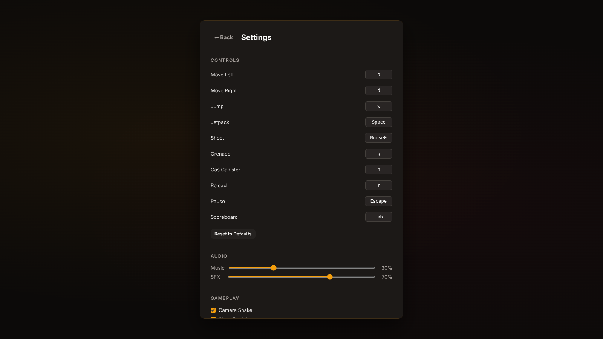 | 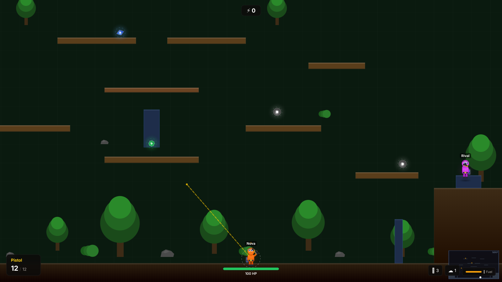 |
| *Settings — audio, visuals, and key rebinding* | *Online match — HUD, minimap, kill feed area* |
|  | 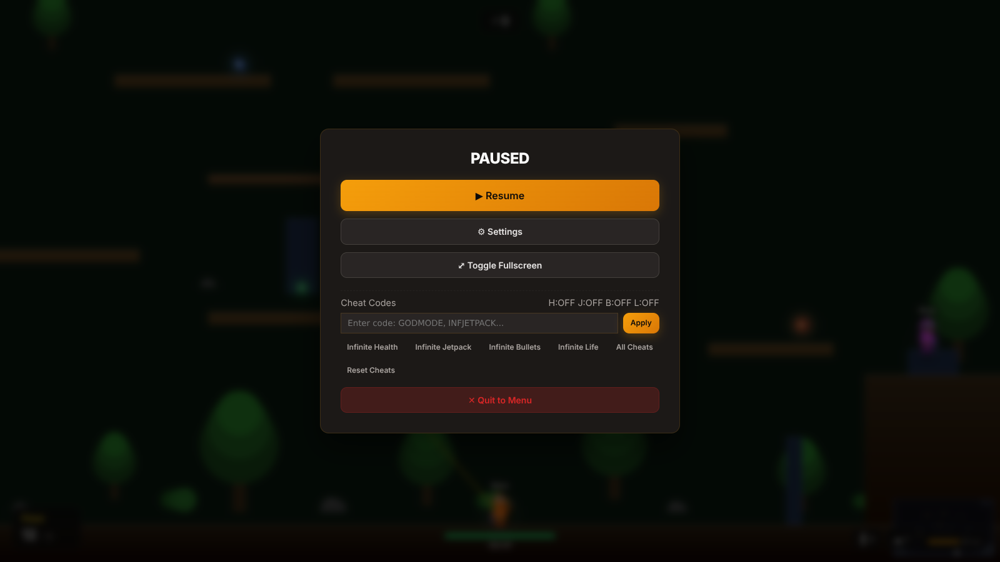 |
| *Scoreboard (hold Tab)* | *Pause menu with cheat-code presets* |
|  | 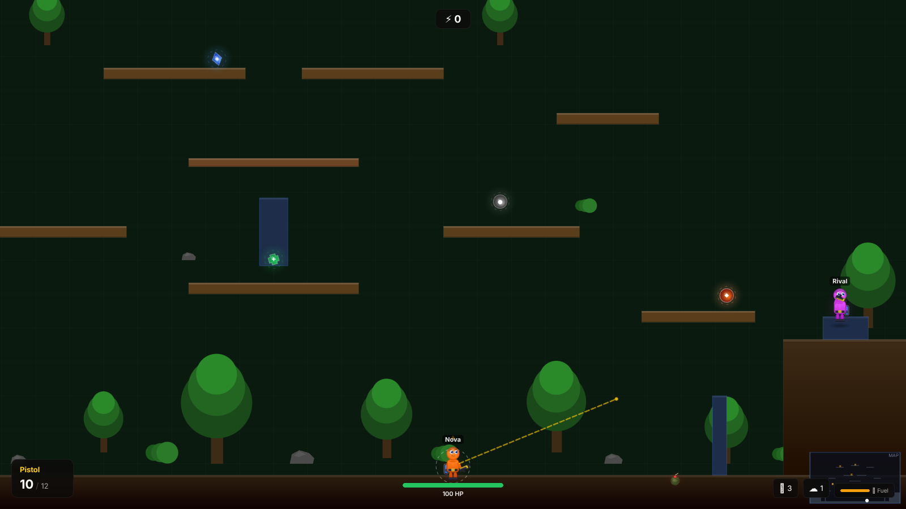 |
| *Combat — tracers and muzzle flash* | *Grenade explosion* |
| 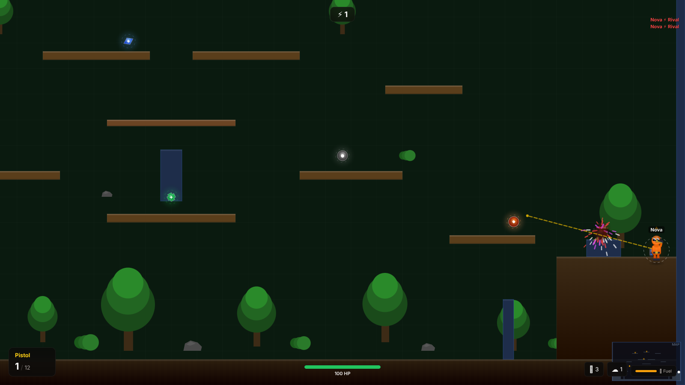 | 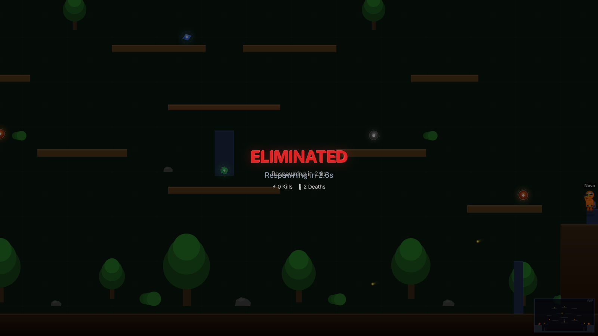 |
| *Kill feed — top-right of the HUD* | *Death screen with respawn countdown* |
| 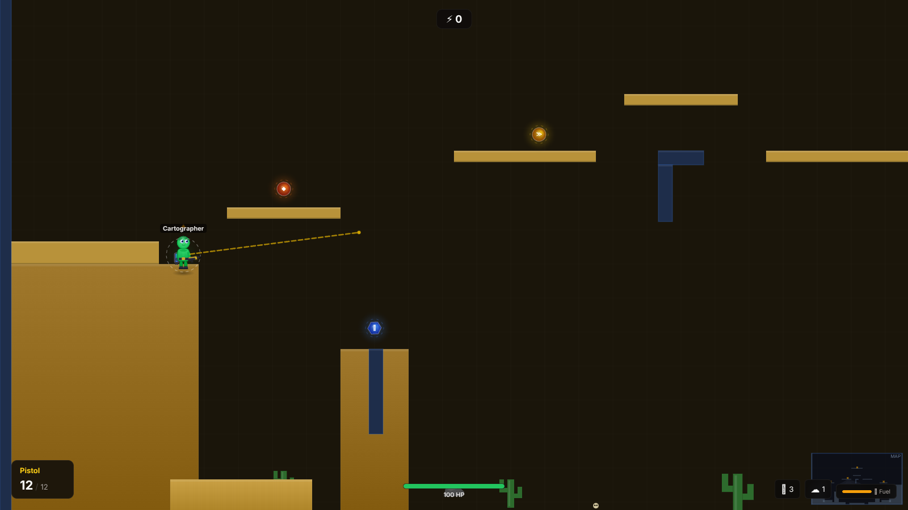 | 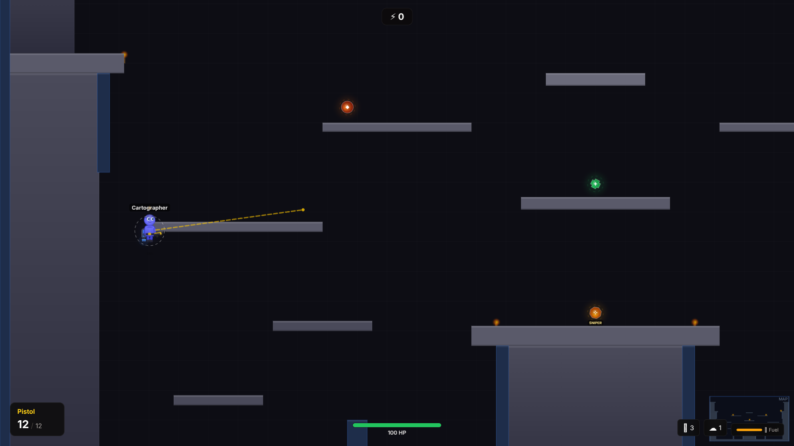 |
| *Arid Canyon (desert map)* | *Dark Fortress (castle map)* |
| 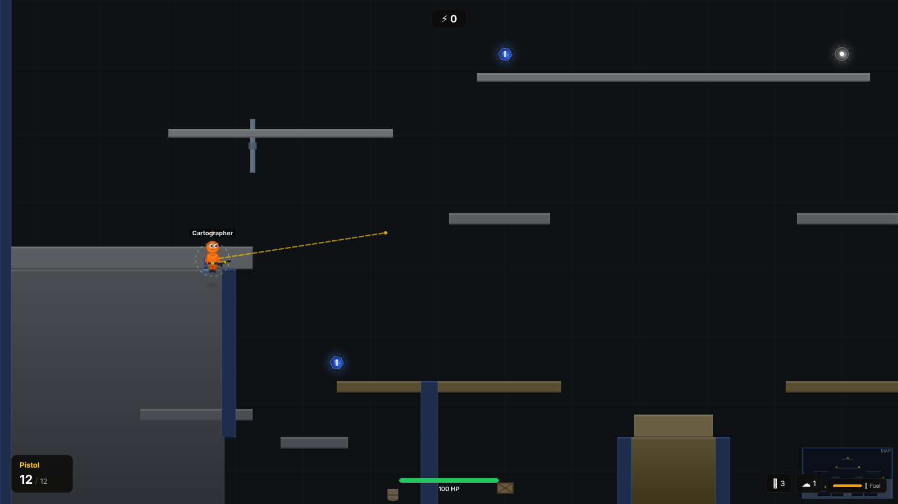 | 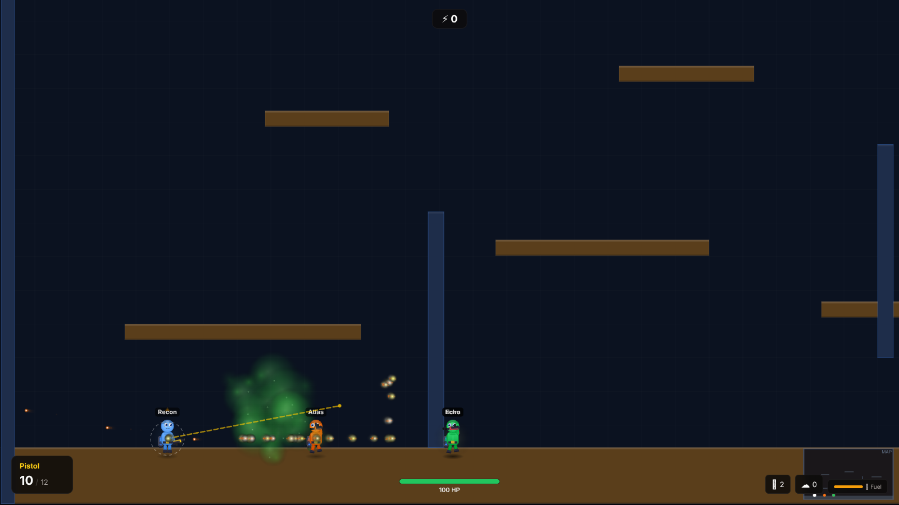 |
| *Abandoned Factory (industrial map)* | *Offline practice against AI bots* |

<p align="center">
  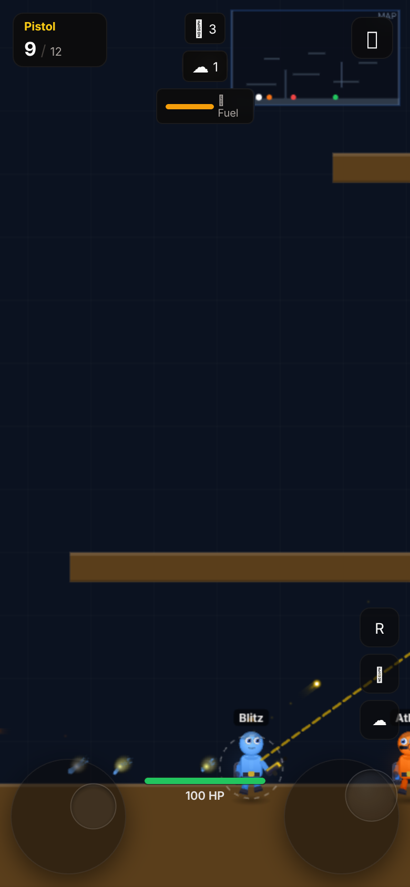<br/>
  <em>Mobile mode — dual virtual joysticks with touch aiming</em>
</p>

---

## Features at a Glance

| Area | Details |
|---|---|
| Players per room | Up to **8** |
| Maps | 4 (forest / desert / castle / industrial) |
| Weapons | 6 (pistol, SMG, shotgun, sniper, rifle, RPG) |
| Projectiles | Fully simulated server-side with wall bounces for grenades |
| Movement | Run, jump, **jetpack** (fuel: 100, drains 40/s in flight, regenerates 25/s on the ground) |
| Pickups | 7 types, respawn continuously (max 10 on a map) |
| Cheats | 5 codes + master toggle, applied from the pause menu |
| Offline mode | Full client-side simulation vs 3 AI bots |
| Mobile | Touch joysticks, drag-to-jump/jetpack, auto-fullscreen |
| Audio | 100% synthesized at runtime via the Web Audio API — zero audio assets |

---

## Architecture: What the Frontend and Backend Do

Grid Wars is a monorepo with two apps:

```
Realtime-Network-Game/
├── src/                  ← FRONTEND (React + Vite, served on :5173 in dev)
│   ├── components/       ← screens & HUD (menu, room browser, pause, death, mobile controls…)
│   ├── engine/           ← canvas renderer, camera, particles, minimap, kill feed
│   └── game/             ← networking, client prediction, input, offline sim, WebRTC, audio
└── backend/              ← BACKEND (Express + Socket.IO, served on :3000)
    ├── server.js         ← HTTP + WebSocket plumbing, REST endpoints, game loop
    ├── gameRoom.js       ← the authoritative simulation for one room
    ├── weapons.js        ← weapon stat table
    ├── physics.js        ← circle-vs-rect collision helpers
    └── maps/             ← the four map definitions
```

### The backend is the referee

`backend/server.js` hosts the HTTP API and Socket.IO, and runs a single **self-correcting game loop** with two fixed timesteps driven by accumulators:

- **Physics at 60 Hz** — every room's `tick(dt)` advances players, bullets, grenades, gas clouds, pickups and respawns.
- **Broadcasts at 20 Hz** — every room's state snapshot is emitted to its players, tagged with the server time and the events (shots, hits, kills, pickups…) that happened since the last snapshot. Rooms are deleted automatically when the last player leaves.

REST endpoints:

| Endpoint | Purpose |
|---|---|
| `GET /rooms` | List active rooms (for the room browser) |
| `GET /maps` | List maps (for the room creator) |
| `GET /weapons` | Weapon stat table |

The backend also serves the built frontend (`dist/`) statically, so a single server can host the whole game in production.

Socket events include `create_room`, `join_room`, `quick_join`, `matchmake`, `input`, `shoot`, `grenade`, `gas`, `cheat_code`, `ping`, plus WebRTC signaling (offer/answer/ICE candidate relay).

`backend/gameRoom.js` is the heart of the simulation: player stats (100 HP, 3-second respawns), weapon firing with ammo and reloads, bullet flight and collisions, grenade arcs with bounces and a 55-damage explosion, gas clouds dealing 8 damage/second, pickup collection within a ~36px radius, spawn-point selection (farthest from other players), and score tracking.

### The frontend is the stage

- **`src/engine/`** — a hand-rolled canvas renderer: camera with smoothing/shake/zoom, layered map rendering, animated characters with weapons, particles (muzzle flash, bullet hits, explosions, jetpack flames), the minimap, the scoreboard, and the kill feed.
- **`src/game/gameClient.js`** — the online client: sends inputs, keeps a **locally predicted copy of your player** so movement feels instant, and reconciles with the server (see [Networking Internals](#networking-internals)).
- **`src/game/offlinePractice.js` + `offlineBrain.js`** — a complete duplicate of the simulation that runs purely in your browser against three bots (Atlas, Nova, Echo, Blaze, Viper and Rook rotate in), including cheat support.
- **`src/game/inputManager.js`** — pointer lock, mouse aiming, and fully rebindable keyboard controls (persisted to `localStorage`).
- **`src/game/audioManager.js`** — every sound effect (shots, hits, explosions, jetpack, UI) is synthesized on the fly with oscillators and noise buffers.
- **`src/components/`** — the React UI around the canvas: main menu, room creation with a map picker, room browser, settings, pause menu with cheat presets, death screen, device-mode prompt, and the mobile touch controls.
- **State** is managed with Zustand (`src/store.js`) — screens, world snapshots, the predicted local player, cheat flags, mobile mode.

---

## Getting Started

### Prerequisites

- **Node.js 18+** (tested on Node 22) and npm

### 1. Start the backend

```bash
cd backend
npm install
npm start          # → http://localhost:3000
```

You should see: `Server on :3000 | physics 60Hz | broadcast 20Hz`.

### 2. Start the frontend

In a second terminal, from the repo root:

```bash
npm install
npm run dev        # → http://localhost:5173
```

Open **http://localhost:5173**, choose *Desktop* (or *Mobile* to try touch controls), set a username, and hit **Create Room** or **Browse**.

> **Tip:** the dev frontend talks to the backend at `VITE_API_BASE_URL` (default `http://localhost:3000`). The main-menu status dot shows whether the backend is reachable.

### 3. Play

- **Online:** Create a room (pick a map), then open the site in another browser/profile, choose **Browse**, and join the listed room. Up to 8 players can join this way. **Quick Play** / matchmaking will find or make a room for you.
- **Offline:** click **Offline Practice** to fight three AI bots with the full simulation running client-side — no backend needed for game logic (only the menu status check uses it).
- **Production-style:** run `npm run build` at the root, then `npm start` in `backend/` — the backend serves the built game from `dist/` on port 3000.

---

## Configuration

### Environment variables

**Frontend** (root `.env` — see `.env.example`):

| Variable | Default | Purpose |
|---|---|---|
| `VITE_API_BASE_URL` | `http://localhost:3000` | Where the game server lives |

**Backend** (`backend/.env` — see `backend/.env.example`):

| Variable | Default | Purpose |
|---|---|---|
| `PORT` | `3000` | HTTP + WebSocket port |
| `CORS_ORIGIN` | `*` | Comma-separated list of allowed frontend origins |

### Default controls (all rebindable in Settings)

| Action | Key |
|---|---|
| Move left / right | `A` / `D` |
| Jump | `W` |
| Jetpack (hold) | `Space` |
| Shoot | Left mouse |
| Grenade | `G` |
| Gas | `H` |
| Reload | `R` |
| Pause / cheat menu | `Escape` |
| Scoreboard (hold) | `Tab` |

### Settings

Music and SFX volume, camera shake, particles, and minimap visibility — plus full key rebinding including the mouse buttons. Settings persist in `localStorage`.

---

## Gameplay Guide

### Weapons

| Weapon | Damage | Bullet speed | Fire rate | Magazine | Notes |
|---|---|---|---|---|---|
| **Pistol** (default) | 18 | 650 px/s | 300 ms | 12 | Reliable all-rounder |
| **SMG** | 10 | 700 px/s | 80 ms (auto) | 30 | Highest sustained DPS |
| **Shotgun** | 12 × 6 pellets | 550 px/s | 600 ms | 6 | Devastating up close |
| **Sniper** | 75 | 1200 px/s | 1200 ms | 5 | 2.5× camera zoom, one-shot territory |
| **Rifle** | 16 | 750 px/s | 130 ms (auto) | 25 | 1.2× zoom, precise auto fire |
| **RPG** | 60 (explosive) | 300 px/s | 2500 ms | 1 | 80px blast radius, splash damage |

Weapon pickups (SMG, shotgun, sniper, rifle, RPG) spawn around the map and swap your loadout with a full magazine.

### Pickups & power-ups

| Pickup | Effect |
|---|---|
| ❤️ Health | Restores HP |
| 🛡 Armor | Adds an armor layer |
| ⛽ Jet fuel | Refills the jetpack |
| 💣 Grenade | +grenades (you start with 3; 3-second cooldown per throw) |
| 🔫 Weapon | Random weapon from the pool above |
| ⚡ Speed | Movement speed boost |
| 🔥 Rapid fire | Halves your fire rate delay |

Pickups spawn continuously (every 10 seconds, up to 10 at once) at fixed spawn points — expect fights over the good ones.

### Maps

| Map | Vibe |
|---|---|
| **Enchanted Forest** | Layered tree platforms and cliffs with bunkers — the reference layout (2400×1400) |
| **Arid Canyon** | Open desert sightlines |
| **Dark Fortress** | Tight castle corridors |
| **Abandoned Factory** | Industrial platforms and cover |

Each map has elevated corner spawns, mid-ground platforms, walls/bunkers for cover, and its own spawn points, pickup points and decoration set.

### Cheat codes (a feature, not a secret)

Open the pause menu (`Escape`) and click a preset or type a code:

| Code | Effect |
|---|---|
| `GODMODE` | Infinite health |
| `INFJETPACK` | Infinite jetpack fuel |
| `INFBULLETS` | Infinite ammo (no reloads) |
| `INFLIFE` | Infinite lives |
| `ALL` | All of the above |
| `RESET` | Turn everything off |

The pause menu shows live ON/OFF status per cheat. Cheats work both online (the server validates and applies them to your player) and in offline practice.

### HUD

- **Top-left**: scoreboard panel (hold `Tab` for the extended version with K/D)
- **Top-right**: kill feed (`Killer ⚡ Victim`, 4-second lifetime) and the minimap
- **Bottom**: health, armor, ammo, grenades and jetpack fuel
- **On death**: a full-screen respawn overlay with a countdown (you respawn after 3 seconds)

---

## Networking Internals

Grid Wars uses a well-established competitive-FPS networking model, tuned for a browser game:

1. **Server authority.** The server simulates everything at 60 Hz and broadcasts snapshots at 20 Hz. Hit registration is server-side — no client can claim a hit.
2. **Client-side prediction.** Your own movement is simulated locally every frame for zero-latency feel. The server only corrects you if you drift more than **50 px** from its truth (anti-cheat snapping).
3. **Input sequencing & reconciliation.** Inputs carry sequence numbers; on correction the client replays unacknowledged inputs on top of the server state.
4. **Snapshot interpolation.** Remote players are rendered ~100 ms in the past (adaptive, with a 16-snapshot buffer), smoothed between authoritative snapshots so everyone appears to move fluidly even at 20 Hz.
5. **RTT measurement.** The client pings the server every 2 seconds to drive the interpolation clock.
6. **WebRTC peer-to-peer movement (optional fast path).** Player-to-player movement updates can flow over a WebRTC data channel (`movement`, ordered, no retransmits) with Google's public STUN server, using Socket.IO only for signaling — with automatic fallback to plain Socket.IO when WebRTC isn't available.

---

## Project Structure

```
├── index.html                  ← Vite entry (Inter font, root div)
├── vite.config.js              ← dev server on :5173
├── vercel.json                 ← frontend deployment (build → dist)
├── src/
│   ├── App.jsx                 ← screen switch (menu / settings / rooms / playing)
│   ├── store.js                ← Zustand global state
│   ├── config.js               ← default controls, localStorage keys
│   ├── styles.css              ← all UI styling
│   ├── components/             ← MainMenu, CreateRoom, RoomBrowser, Settings,
│   │                             PauseMenu, HUD, DeathScreen, GameCanvas,
│   │                             DeviceModePrompt, MobileControls
│   ├── engine/                 ← renderer, camera, characterRenderer, weaponRenderer,
│   │                             mapRenderer, effectsRenderer (kill feed/scoreboard),
│   │                             minimapRenderer, particles
│   └── game/                   ← network, gameClient (online), offlinePractice,
│                                 offlineBrain (bot AI), webrtcManager, inputManager,
│                                 clientPhysics, audioManager
├── backend/
│   ├── server.js               ← Express + Socket.IO + game loop + REST + static hosting
│   ├── gameRoom.js             ← authoritative room simulation
│   ├── weapons.js              ← weapon table
│   ├── physics.js              ← collision helpers
│   └── maps/                   ← forest, desert, castle, industrial (+ index)
└── docs/
    ├── logo.svg                ← project logo
    └── screenshots/            ← automated Playwright captures (this README)
```

---

## Deployment

**Frontend (Vercel):** the repo ships `vercel.json` — connect the repo, Vercel runs `npm run build` and serves `dist/`. Set `VITE_API_BASE_URL` to your backend URL at build time.

**Backend (Render or any Node host):** deploy the `backend/` directory with `npm start` (Node). Configure:

- `PORT` — Render injects this automatically
- `CORS_ORIGIN` — your frontend origin(s), comma-separated (defaults to `*`)

The backend also serves a built frontend from `dist/` if you place one there, so a single service can run the whole game.

---

## Troubleshooting & Known Quirks

- **The main-menu status dot is red** — the backend isn't reachable. Check that `backend/ npm start` is running and `VITE_API_BASE_URL` points at it.
- **Can't join a friend's room** — check `CORS_ORIGIN` on the backend includes your frontend's origin (or is `*`), and that both of you are on the same server.
- **`Portal.bat` files** in the repo root and `backend/` are Windows convenience launchers; their window titles still say "StudentHub" — a leftover from an earlier project. They just start the respective dev servers.
- **WebRTC console warnings** (`setRemoteDescription … wrong state`) can appear when two players connect at the same moment; they're harmless — the game falls back to Socket.IO transport.
- **`styles.css`** contains some leftover rules from an earlier grid/board prototype (`.app`, `.board`, `.cell`) that are unused but harmless.
- Screenshots in `docs/screenshots/` were captured by an automated harness (two headless browsers playing a real match against the live server), which is why the player names/colors vary.

---

## Tech Stack

| Layer | Technology |
|---|---|
| Frontend | React 18, Vite 5, Zustand 4, Socket.IO Client 4.7 |
| Rendering | HTML5 Canvas (custom engine, no game framework) |
| Audio | Web Audio API (fully synthesized) |
| Backend | Node.js, Express 4, Socket.IO 4.7 |
| Real-time extras | WebRTC DataChannels (movement fast path), Google STUN |
| Deployment | Vercel (frontend), Render (backend) |

---

*Grid Wars — pick a map, grab a rifle, and mind the cliff corners.*
